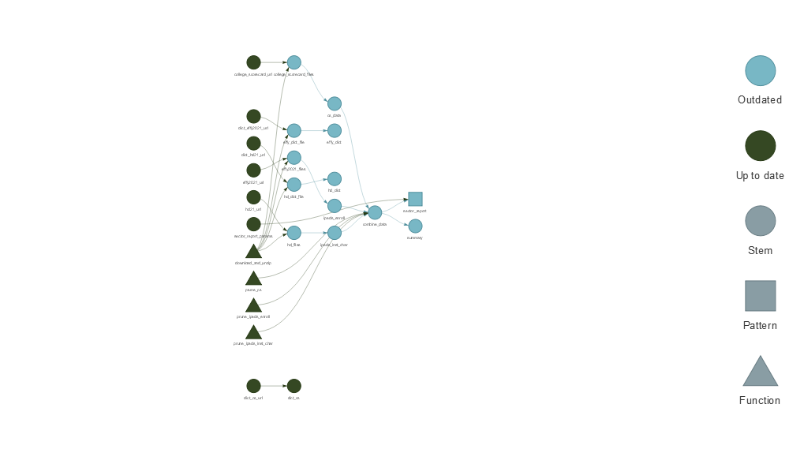

<!-- README.md is generated from README.Rmd. Please edit that file -->

# IPEDS Pipeline Example

<!-- badges: start -->
<!-- badges: end -->

# IPEDS Pipeline Example

This package demonstrates how to use the `targets` package to build a
data pipeline in R. This example uses [IPEDS data from the US Department
of
Education](https://nces.ed.gov/ipeds/datacenter/DataFiles.aspx?year=2020&surveyNumber=-1&gotoReportId=7&).

## To Run

Download the repository and run `targets::tar_make()` in the working
directory.

To view the pipeline you can run `targets::tar_visnetwork()`.

``` r
targets::tar_visnetwork()
```

<!-- -->

## Fall Workshop 2022

This repository accompanies a session by Jared Knowles at Fall Workshop
2022 for the Strategic Data Project Higher Education Fellowship.
